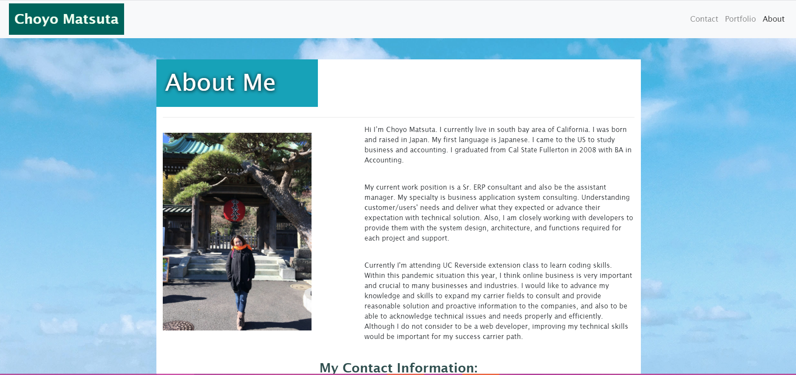
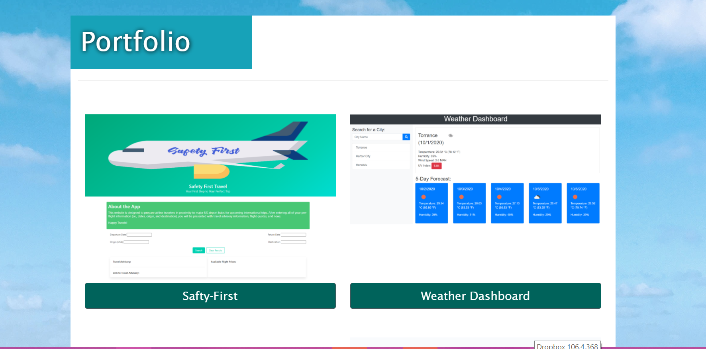

# Responsive Portfolio

Create responsive portfolio by using HTML, CSS, bootstrap and font awsome.

## Link to deployed app
[my portfolio link](https://cmatsuta.github.io/myportfolio/)

## APP Description
* About me
Used navbar and grid system to write about my biography.
Uploaded the picture of me in the image file.
Link to my GitHub page, LinkedIn, and resume. 

* Portfolio
Used same navbar for index.html.
Develop your portfolio.html with focusing on the responsive layout and images.
Insert Alt tags with image descriptions 
Link to my GitHub repository for project and assignment I worked on. 

* Contact
Used same navbar for index.html. Used one of forms from bootstrap.
Adjust the form style with css.

## Contact Information
Choyo Matsuta: [GitHub link](https://github.com/cmatsuta)

### Released under MIT License
Copyright <2020> Choyo Matsuta

Permission is hereby granted, free of charge, to any person obtaining a copy of this software and associated documentation files (the "Software"), to deal in the Software without restriction, including without limitation the rights to use, copy, modify, merge, publish, distribute, sublicense, and/or sell copies of the Software, and to permit persons to whom the Software is furnished to do so, subject to the following conditions:

The above copyright notice and this permission notice shall be included in all copies or substantial portions of the Software.

THE SOFTWARE IS PROVIDED "AS IS", WITHOUT WARRANTY OF ANY KIND, EXPRESS OR IMPLIED, INCLUDING BUT NOT LIMITED TO THE WARRANTIES OF MERCHANTABILITY, FITNESS FOR A PARTICULAR PURPOSE AND NONINFRINGEMENT. IN NO EVENT SHALL THE AUTHORS OR COPYRIGHT HOLDERS BE LIABLE FOR ANY CLAIM, DAMAGES OR OTHER LIABILITY, WHETHER IN AN ACTION OF CONTRACT, TORT OR OTHERWISE, ARISING FROM, OUT OF OR IN CONNECTION WITH THE SOFTWARE OR THE USE OR OTHER DEALINGS IN THE SOFTWARE.

